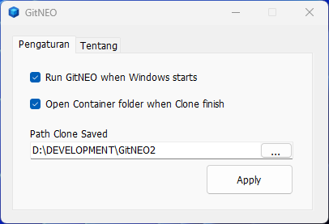
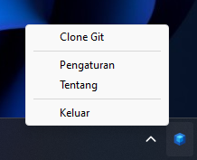
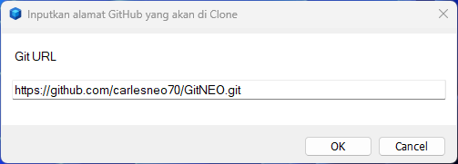

 

  

  <h3 align="center">GitNEO</h3>

  

    An Awesome Git Clone Helper!
     
     
    <a href="https://github.com/carlesneo70/GitNEO">View Demo</a>
    .
    <a href="https://github.com/carlesneo70/GitNEO/issues">Report Bug</a>
    .
    <a href="https://github.com/carlesneo70/GitNEO/issues">Request Feature</a>
  

   

## About The Project

Aplikasi OpenSource untuk melakukan kloning dari GitHub ke direktori yang diinginkan. Aplikasi ini memerlukan instalasi Git sebelumnya dan hanya menggunakan command prompt sebagai perantara.

## Built With

Selain keahlian khusus di bidang pemrograman, dibutuhkan juga tool-tool pendukung yang akan digunakan dalam proses pengembangannya. Berikut adalah tool-tool yang dibutuhkan untuk proses pengembangan GitNEO.

    Visual Studio Community 2022 atau versi yang lebih tinggi

    .NET Framework 4.7 atau versi yang lebih tinggi

## Roadmap

See the [open issues](https://github.com/carlesneo70/GitNEO/issues) for a list of proposed features (and known issues).

## Contributing

Contributions are what make the open source community such an amazing place to be learn, inspire, and create. Any contributions you make are **greatly appreciated**.
* If you have suggestions for adding or removing projects, feel free to [open an issue](https://github.com/carlesneo70/GitNEO/issues/new) to discuss it, or directly create a pull request after you edit the *README.md* file with necessary changes.
* Please make sure you check your spelling and grammar.
* Create individual PR for each suggestion.
* Please also read through the [Code Of Conduct](https://github.com/carlesneo70/GitNEO/blob/main/CODE_OF_CONDUCT.md) before posting your first idea as well.

### Creating A Pull Request

1. Fork the Project
2. Create your Feature Branch (`git checkout -b feature/AmazingFeature`)
3. Commit your Changes (`git commit -m 'Add some AmazingFeature'`)
4. Push to the Branch (`git push origin feature/AmazingFeature`)
5. Open a Pull Request

## License

Source code GitNEO menggunakan lisensi Apache. Lisensi Apache adalah lisensi untuk perangkat lunak bebas guna yang ditulis oleh Apache Software Foundation (ASF). Lisensi ini memberikan hak penggunaan paten secara langsung dari si pembuat perangkat lunak kepada pengguna.

Pada perangkat lunak berlisensi ini, pengguna boleh menggunakannya untuk tujuan komersil, pengguna boleh mendistribusikan ulang, memodifikasi, menggunakan paten, dan boleh menerapkan lisensi yang berbeda dari perangkat lunak asal. Pengguna juga boleh menggunakan dan memodifikasi perangkat lunak secara pribadi tanpa ada kewajiban untuk mendistribusikan ulang. Pengguna harus menyertakan lisensi ini pada perangkat lunak turunan yang didistribusikan, menyertakan hak cipta asli si pembuat, serta menyertakan perubahan apa saja yang dilakukan (apabila dimodifikasi). Pengguna tidak boleh menggunakan trademark, logo, atau mengatasnamakan si pembuat dalam proses distribusi ulang dan tidak punya hak untuk menuntut si pembuat ketika terjadi kerusakan pada perangkat lunak tersebut.

Riau, Januari 2024

Charles Nainggolan

## Authors

* **Charles Neo** - *Universitas Terbuka* - [Charles Neo](https://github.com/carlesneo70/) - *Hire Me*

## Acknowledgements

* [ReadME GENERATOR](https://readme.shaankhan.dev/)
